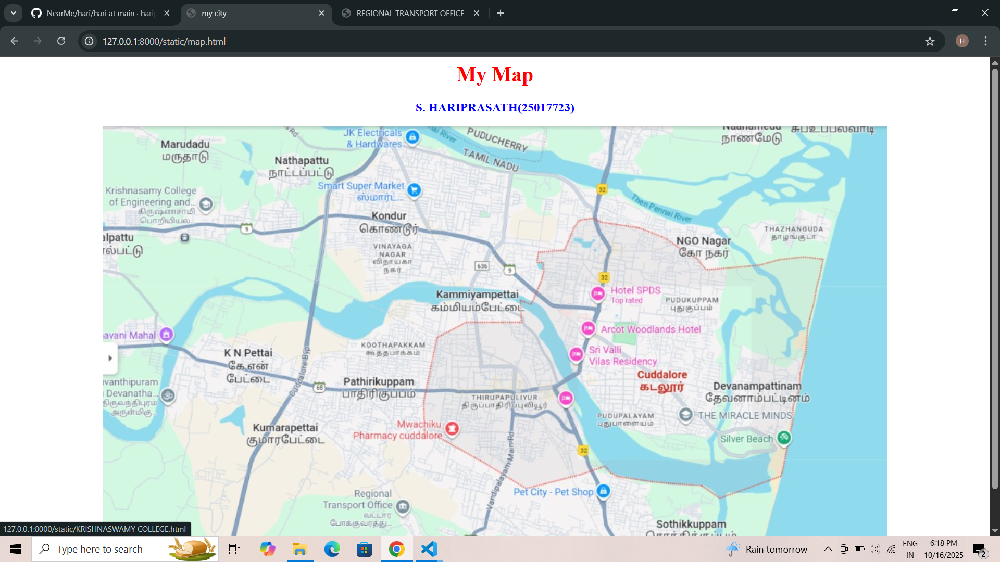

# Ex04 Places Around Me
## Date: 28/09/2025

## AIM:
To develop a website to display details about the places around my house.

## DESIGN STEPS:

### STEP 1:
Create a Django admin interface.

### STEP 2:
Download your city map from Google.

### STEP 3:
Using ```<map>``` tag name the map.

### STEP 4:
Create clickable regions in the image using ```<area>``` tag.

### STEP 5:
Write HTML programs for all the regions identified.

### STEP 6:
Execute the programs and publish them.

## CODE:
~~~
map.html

<html>
    <head>
        <title>my city</title>
    </head>
    <body>
 <h1 align="center">
    <font color="red"><b>My Map</b></font>
 </h1>       
<h3 align="center">
    <font color="blue"><b>S. HARIPRASATH(25017723)</b></font>
</h3>        
        

<!-- Image Map Generated by http://www.image-map.net/ -->
<center>

</center>

<map name="image-map">
    <area target="_blank" alt="" title="" href="SILVER BEACH.html" coords="940,455,1043,498" shape="rect">
    <area target="_blank" alt="" title="" href="REGIONAL TRANSPORT OFFICE.html" coords="346,556,484,614" shape="rect">
    <area target="_blank" alt="" title="" href="JAIL HILL.html" coords="374,641,472,684" shape="rect">
    <area target="_blank" alt="" title="" href="PET CITY.html" coords="616,607,804,530" shape="rect">
    <area target="_blank" alt="" title="" href="KRISHNASWAMY COLLEGE.html" coords="-1,87,151,157" shape="rect">
</map>
       
    </body>
</html>


PET CITY.html

<html>
    <head>
        <title>PET CITY</title>
    </head>
    <body>
        <p align="center" >The Cuddalore Pet City is located in Cuddalore, offering a variety of pet supplies and products, with a 10% discount on all products available for online orders. You can find them on Instagram at @the_cuddalore_pet_city 


        </p>
    </body>
</html>


REGIONAL TRANSPORT OFFICE.html

<html>
    <head>
        <title>REGIONAL TRANSPORT OFFICE</title>
    </head>
    <body bgcolor="yellow">
        <h1>REGIONAL TRANSPORT OFFICE</h1>
        <p align="center" >The Regional Transport Office (RTO) in Cuddalore, also known as RTO TN-31, is located at SN Chavadi, Cuddalore, Tamil Nadu - 607001. You can contact them by phone at +(91)-4142-290035. The office operates from 09:30 AM to 06:30 PM. Their primary functions include motor vehicle registration and tax collection, driving license issuance, vehicle inspection, and managing permits for road transportation. 


        </p>
    </body>
</html>


JAIL HILL.html

<html>
    <head>
        <title>JAIL HILL</title>
    </head>
    <body bgcolor="yellow">
        <h1>JAIL HILL</h1>
        <p align="center" >"Cuddalore jail hills" likely refers to Capper Hills, the location of the Cuddalore Central Prison, established during the British Raj by General Capper. This large, open-air prison is situated on an area characterized by sand dunes and is locally known for its history of housing political leaders. 


        </p>
    </body>
</html>


SILVER BEACH.html

<html>
    <head>
        <title>SILVER BEACH</title>
    </head>
    <body bgcolor="yellow">
        <h1>SILVER BEACH</h1>
        <p align="center" >Silver Beach in Cuddalore is a 57 km long, tranquil beach on the Coromandel Coast of India, known for its panoramic beauty, clear waters, and silvery sand. Located 2 km from downtown Cuddalore, it offers a peaceful atmosphere and is being developed as a Blue Flag certified beach. Visitors can enjoy water sports, summer festivals, and explore nearby attractions like Fort St. David.   


        </p>
    </body>
</html>


KRISHNASWAMY COLLEGE.html

<html>
    <head>
        <title>KRISHNASWAMY COLLEGE</title>
    </head>
    <body bgcolor="yellow">
        <h1>KRISHNASWAMY COLLEGE</h1>
        <p align="center" > Almost 65% of the students got placed in core companies, but remaining students are trying for some other department jobs. However, 100% of the students got selected in the campus interviews. Top recruiting companies of our college are Infosys and Wipro. Almost 60% of the students got an internship. We are happy to write C languages code.


        </p>
    </body>
</html>

~~~


## OUTPUT:



## RESULT:
The program for implementing image maps using HTML is executed successfully.
